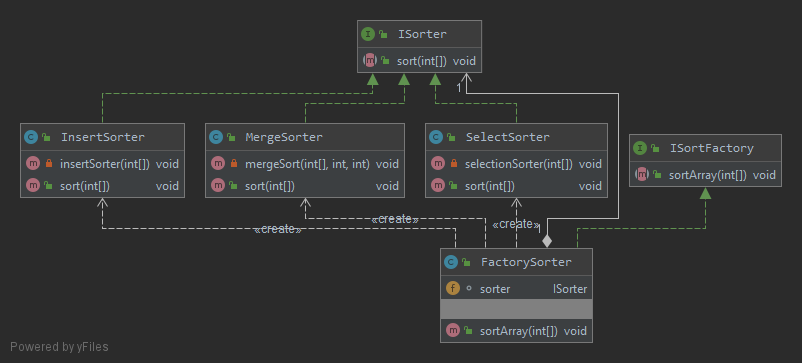

# ДЗ: Шаблон Абстрактная Фабрика
1. Создать программу, которая в качестве входного параметра получает вариант сортировки (выбором, вставки, слиянием)
2. Реализовать в программе абстрактную фабрику и конкретные фабрики, отвечающие за каждый вариант сортировки как продукты.
3. Программа записывает результаты в консоль. В содержании в пишется тип сортировки и результаты.

# Диаграмма классов
